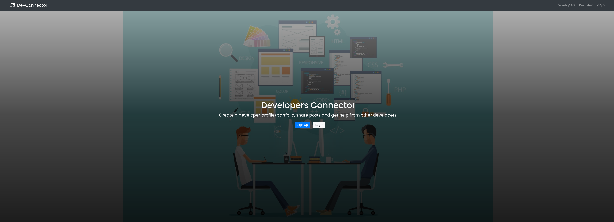
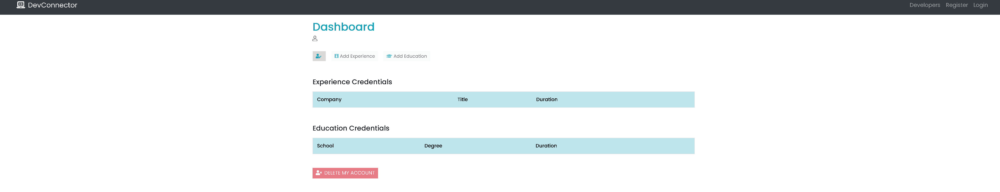

<h1 align="center">DevConnector Web App using React JS</h1>
  
<p align="center">
    
    
    
</p>

 <h4>🔍 Designed and coded by | <a href="https://github.com/JamesVelarde">James Velarde</a> | <a href="https://github.com/Hanstyl">Nathan Nelson</a> | <a href="https://github.com/alviszheng">Alvis Zheng</a> | <a href="https://github.com/xxx">Shad</a>

<br>

Provide a small community for new developer to exchange projects, ideas. 

✋ [GitHub Repository](https://github.com/Hanstyl/popcorn)

✋ [Deployed Heroku link](https://developer-dashboard-mern.herokuapp.com)

## Table of Contents

- [Technologies used](#technologies-used)
- [Wireframe](#wireframe)
- [Installation local env](#installation-local-env)
- [Screenshots](#screenshots)
- [License](#license)
- [Contributing](#contributing)
- [Development](#development)
- [Tests](#tests)
- [Links](#links)
- [Questions](#questions)

## 💿 Technologies used

1. `Node JS Express Framework` is used as a building Backend part of this Website.
2. `MySQL` is used to Store User Details, passwords and URL of Photos.
3. `JWT` is used for for Authenticate a User. User can only authenticate using **Custom Email Password** Method.
4. `React JS` is used as frontend Framework for building SPA.
5. `Redux` for State Management on React Application
6. `Bootstrap` is used for building UI and this website is Responsive for Desktop Devices and Tabs only (I am working on for responsiveness on small Devices)
7. `Heroku` is used for hosting the backend code and frontend as well.


## 🖼️ Wireframe


## 💾 Installation local env

1. **Prerequisites**

  - NodeJS installed on your Local machine
  - MySQL (version 8.0) installed on your local machine or have any MySQL database hosted online 
    - First I use [CloudClusters](https://www.cloudclusters.io/) for my project.
    - Now, I am using [Digital Ocean](https://m.do.co/c/bf7c82c22af1) Droplet to install mysql and use it remotely to my app.

2. **Project Setup**

   - Clone this Repository or Download the zip File.
        ```
        $ git clone https://github.com/Hanstyl/popcorn.git

   - Create a new file named `.env` on `root` directory which contains all of our secret credentials for this project.
        ```
        DB_HOST = <Database Hostname>
        DB_PORT = <Database Port>
        DB_USER = <Database User>
        DB_USER_PASSWORD = <Database User Password>
        DB_DATABASE = <Database Name>
        BCRYPT_SALT_LENGTH = 10
        JWT_SECRET = <Your JWT Secret>
        JWT_RANDOM_STRING = <Any Random String>
        JWT_COOKIE_MAX_AGE = 86400
        GITHUB_TOKEN = <Personal Access Token for Github API>
        ```

   - Run this command

        ```
        $ npm run dev  // to start React Development server and Backend server together.

        $ npm run server // to start only Backend server

        $ npm run Client // to start React Development server only (But it will not working alone as api depends on Backend also)
        ```

## 📖 User Story

As a new developer
I want a GIVEN a small community to share my projects and ideas
So that I can develop my skills

## 📷 Screenshots

##  

## 

## ✏️ License

  [](https://opensource.org/licenses/ISC)
  <br />
  Copyright <2021>

Permission to use, copy, modify, and/or distribute this software for any purpose with or without fee is hereby granted, provided that the above copyright notice and this permission notice appear in all copies.

THE SOFTWARE IS PROVIDED "AS IS" AND THE AUTHOR DISCLAIMS ALL WARRANTIES WITH REGARD TO THIS SOFTWARE INCLUDING ALL IMPLIED WARRANTIES OF MERCHANTABILITY AND FITNESS. IN NO EVENT SHALL THE AUTHOR BE LIABLE FOR ANY SPECIAL, DIRECT, INDIRECT, OR CONSEQUENTIAL DAMAGES OR ANY DAMAGES WHATSOEVER RESULTING FROM LOSS OF USE, DATA OR PROFITS, WHETHER IN AN ACTION OF CONTRACT, NEGLIGENCE OR OTHER TORTIOUS ACTION, ARISING OUT OF OR IN CONNECTION WITH THE USE OR PERFORMANCE OF THIS SOFTWARE.

## 👪 Contributing

- <a href="https://github.com/JamesVelarde">James Velarde</a> 
- <a href="https://github.com/Hanstyl">Nathan Nelson</a>
- <a href="https://github.com/alviszheng">Alvis Zheng</a> 
- <a href="https://github.com/xxx">Shad Pike</a> 

## 🔍 Issues

No issues at this time.

## ⚙️ Development

- Email Verification by SendGrid API
- User Profile Image upload feature
- Forgot Password feature
- Pagination feature on Posts and Developers page

## ✏️ Testing

No testing at this time.

## 🔍 Links

- [This app is deployed on Heroku (click here to see app)](https://developer-dashboard-mern.herokuapp.com)

## ❓ Questions

  If you have any queries feel free to contact us through our Github profile at  
  👋 [James](https://github.com/JamesVelarde)<br>
  👋 [Nathan](https://github.com/Hanstyl)<br>
  👋 [Alvis](https://github.com/alviszheng)<br>
  👋 [Shad](https://github.com/xxx)<br>